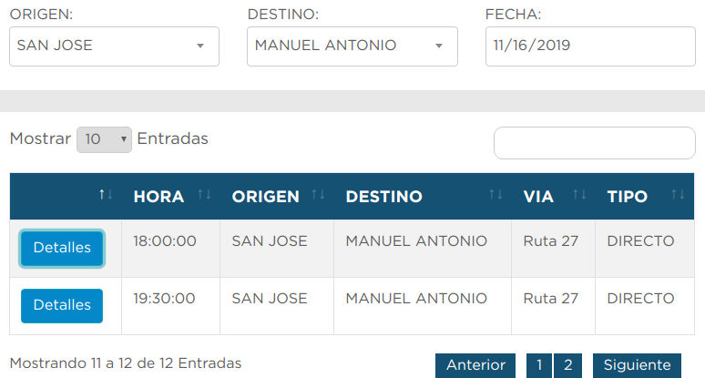

# Actividades

# Itinerario:

#### Horario de Miguel:

**Nov 11** pasear por SJ
**Nov 12** Salir a corcovado

  

**Nov 13** pasar dia en corcovado y salir a uvita de noche o 13 en la madrugadapasear en uvita y dormir
**Nov 14 Jueves:** pasear Uvita y Salir a las 5 pm a ciudad manuel antonio y pasar la noche en manuel antonio
**Nov15 Parque manuel antonio**, parque MA hasta cerrar (4pm) pasear en la ciudad hasta tarde, regresar a SJ para hora de cena. cenar en mirador de san jose, dormir en SJ
**Nov 16 Pasear en monteverde** salir de SJ en la madrugada y pasear en monteverde, dormir en

http://terminal7-10.com/es/rutas/monteverde/

**Nov 17 pasear en monteverde y salir hacia la fortuna de noche/de tarde** dormir en la fortuna
**Nov 18 Parque Arenal y despues pasear en la fortuna**

**Nov 19 partida** : martes

#### Horario de Yun:

**Nov 14 Jueves:**
- _**Ve al punto de venta de la compania tracopa y compra boleto de autobus de SJ a Manuel antonio apenas llegues al pais**_ pasear por SJ y Salir en la tarde  a ciudad manuel antonio y pasar la noche en manuel antonio

**Nov15 Parque manuel antonio**, parque MA hasta cerrar (4pm) pasear en la ciudad hasta tarde, regresar a SJ para hora de cena. cenar en mirador de san jose, dormir en SJ
**Nov 16 Pasear en monteverde** salir de SJ en la madrugada y pasear en monteverde, dormir en

http://terminal7-10.com/es/rutas/monteverde/

**Nov 17 pasear en monteverde y salir hacia la fortuna de noche/de tarde** dormir en la fortuna
**Nov 18 Parque Arenal y despues pasear en la fortuna**, pasar en la ciudad hasta la noche, regresar a SJ de tarde/noche, tal vez cenar en otro mirador, dormir en SJ

**Nov 19 partida** : martes

### Parque Nacional Corcovado
- No se puede entrar sin guia ?!??!
- pasar una noche, el unico lugar es en el Sector Sirena (30$, 25$ desayuna... 30$ cena.... , llevar comida si posible)

### Parque nacional Manuel Antonio
- Horario: 7 am a 4 pm

- cerrado los lunes!
- 16 $
- Bus, 5-9$

- https://www.tracopacr.com/Punto_Venta  (por internet no se puede comprar?) No!
- punto de venta en SJ
- https://www.tripadvisor.com/ShowTopic-g309293-i1208-k11126099-How_to_get_from_San_Jose_Airport_to_Manuel_Antonio-San_Jose_San_Jose_Metro_Province_of_San.html
- https://breakingabroad.com/how-to-san-jose-manuel-antonio/

#### Rutas y horarios (hay mas fechas y horarios)

https://www.tracopacr.com/Rutas_Horarios

 
 

- The small cafes within Manuel Antonio will refill your water bottle for a fee. Since the tap water in Costa Rica is safe to drink, you can also use the water spigots near the bathroom or down by the sand at Manuel Antonio Beach for free.  

###### Preguntas:
- que tanta agua se necesita?
- comida? se puede entrar con comida?
- se puede dormir en el parque?

### Ziplining
Lugares:
- Monteverde
- La Fortuna
- Guanacaste

### Surfing
Beaches
- Pavones, Jaco, Santa Teresa, Playa Hermosa, Playa Cocles, etc

#### Parque nacional arenal Volcan
-  8 am to 4 pm
- 15$
- coladas (sendero_)
- cerca de La Fortuna

#### White water rafting
- rio pacuare

# San jose
- Restaurante ram luna
- Restaurante Tiquicia

#### puentes de madera colgantes del Arenal
