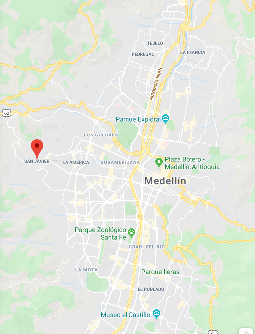
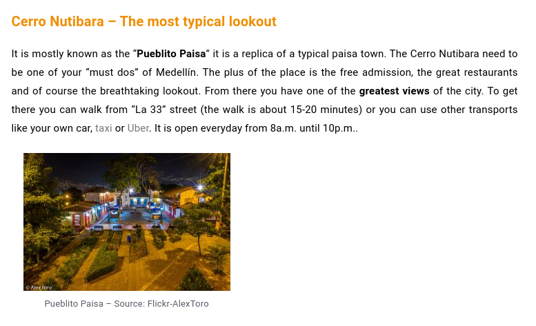
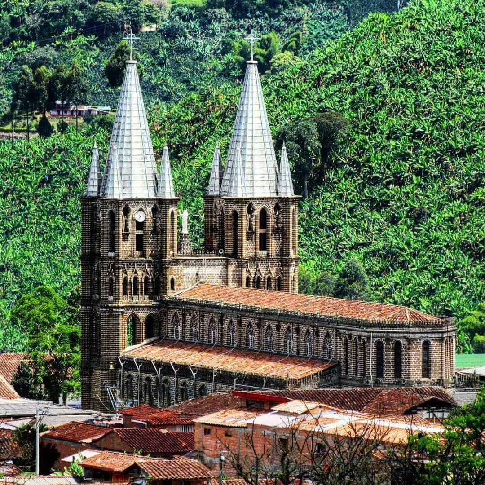
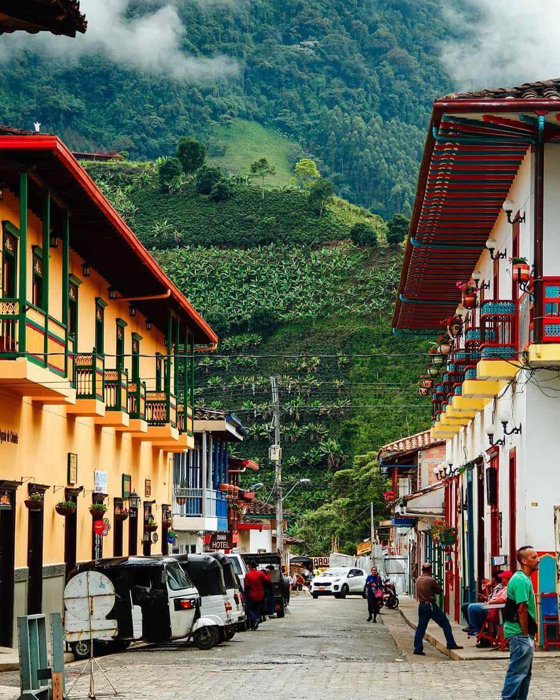
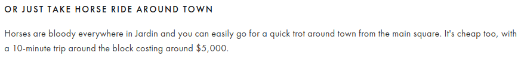
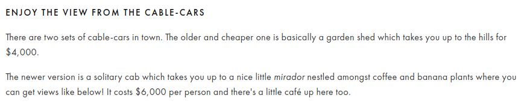
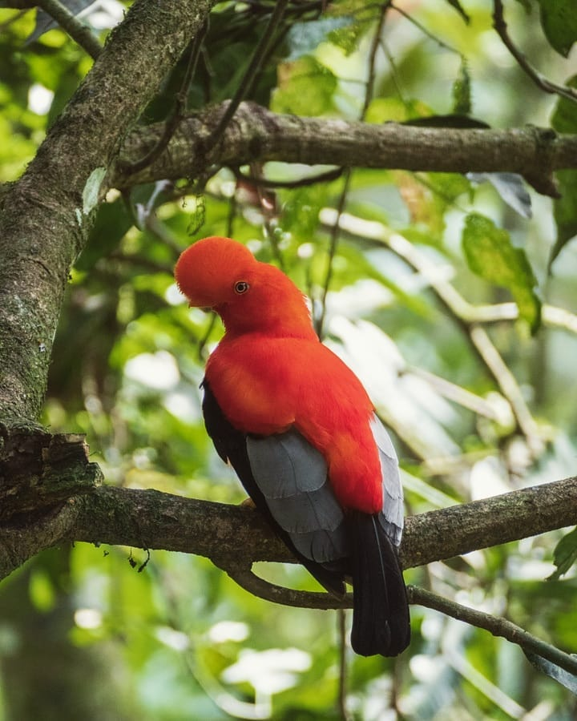
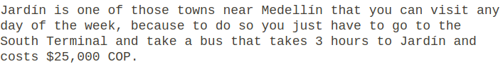

# Medellin
### Lugares y Actividades
1) Plaza Botero
2) Grafiti Tour Communa 13
3) Jardin Botanico
4) Parque Explora
5) Pueblito Paisa + Mirador

### Plaza Botero
- bajarse en Parque Berrio estacion

### Communa 13

### Jardin Botanico
- gratis
- Parada Universida

### Parque explora
- 27,000 COP
- vecino a jardin botanico

### pueblito paisa + Cerro nutibara

# Pueblos Cercanos
1) Guatape
2) Santa Elena
3) Santa Fe de Antioquia
4) Jardin
5) Jerico

# Jardin

 

### Actividades Y Lugares

- Parque pricipal
- Basilica de la immaculada concepcion
- Cristo mirador

- reservas naturales
- caverna de Guacharos
- Cascada angel
- caverna esplendor
- Cascada el amor
- Charco Corazon
- Escalera de Cristal

 

#### Transporte de Medello

