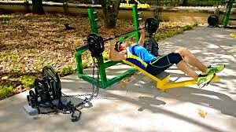
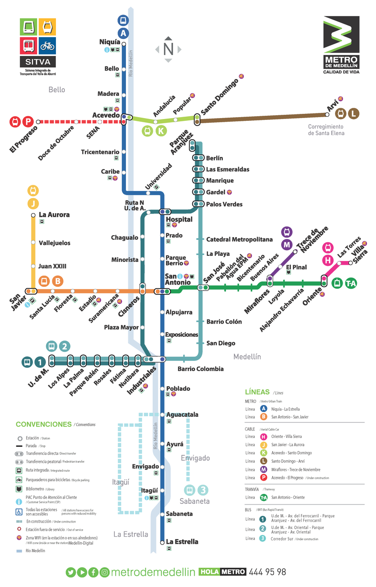

# Medellin
### Lugares y Actividades
1) Plaza Botero
2) Grafiti Tour Communa 13
3) Jardin Botanico
4) Parque Explora
5) Pueblito Paisa + Mirador
6) Cerro de las tres cruces
7) Cerro el volador
8) Parque Arvi

### Cerros

https://medellinguru.com/pan-de-azucar/
https://medellinguru.com/cerro-de-las-tres-cruces/

https://medellinguru.com/volador/

 

### Gimnasio Urbano Gratuito
- Gimnasio Urbano INDER unidad Deportiva Atanasio Girardot

#### El Gimnasio Mas Completo

- Unidad deportiva de Belen

 

### Plaza Botero
- bajarse en Parque Berrio estacion

### Communa 13

- San Javier es la ultima estacion de la linea B

Free Grafiti Tour:
https://www.freetour.com/medellin/medellin-graffitour-comuna-13-tour-gratis

### Jardin Botanico
- gratis
- Parada Universida

### Parque explora
- 27,000 COP
- vecino a jardin botanico

### pueblito paisa + Cerro nutibara

### Parque arvi

source: https://www.mividaenmedellin.com/blog/2018/9/25/guide-for-parque-arvi

https://medellinguru.com/parque-arvi/

### Vida Nocturna

**Laureles**

**El Poblado**

### Transporte Publico

## Pueblos Cercanos
1) Guatape
2) Santa Elena
3) Santa Fe de Antioquia
4) Jardin
5) Jerico

# Jardin

 

### Actividades Y Lugares

- Parque principal
- Basilica de la immaculada concepcion
- Cristo mirador

- reservas naturales
- caverna de Guacharos
- Cascada angel
- caverna esplendor

- Cascada el amor
- Charco Corazon
- Escalera de Cristal
- Reserva naturales Jardin de Rocas

- Sendero Lechuza y Garrucha

 

#### Transporte desde Medello

 

### Gastronomia

